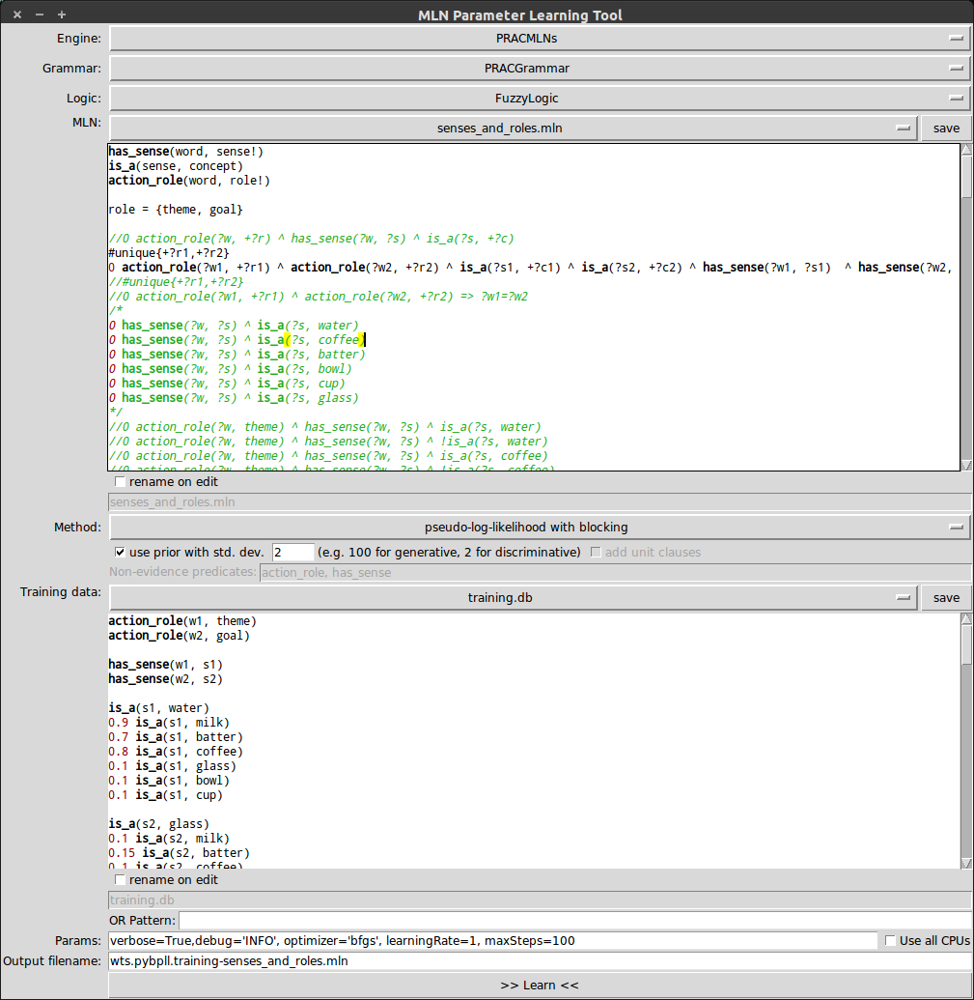

MLN-Learning-Tool
=================

Start the tool from the command line with ``mlnlearn``.

   The MLN-Learning-Tool GUI.

The MLN learning tool learns the weights of a MLN file given a 
training database and a template MLN. The tool allows you to invoke 
the actual MLN learning algorithms of either the Python-based MLN 
engine or the Alchemy system. Once you start the actual algorithm, 
the tool window itself will be hidden as long as the job is 
running, while the output of the algorithm is written to the 
console for you to follow. At the beginning, the tools list the 
main input parameters for your convenience, and, at the end, the 
query tool additionally outputs the inference results to the 
console (so even if you are using the Alchemy system, there is not 
really a need to open the results file that is generated).

The tool features an integrated editor for ``*.db`` and ``*.mln`` files. If 
you modify a file in the internal editor, it will automatically be 
saved as soon as you invoke the learning method. The new content 
can either be saved to the same file (overwriting the old content) 
or a new file, which you can choose to name as desired. 
Furthermore, the tool will save all the settings you made whenever 
the learning method is invoked, so that you can easily resume a 
session.

Parameters
----------

In the text field 'Params', you have the opportunity to pass additional
parameters to the tool and the learning algorithms, respectively.
The parameters need to be specified in the Python dictionary syntax
as they will be transformed into and passed to the algorithms as
python dictionaries.

Currently, the following parameters are supported:

*  ``debug='<level>'`` This will temporarily set the debug level to the 
   one specified. Admissible values are (with decreasing level of verbosity): 
   ``DEBUG``, ``INFO``, ``WARNING``, ``ERROR``, ``CRITICAL``.
   
*  ``output=True/False`` Specifies whether or not the learned MLN will be 
   printed to the console after the algorithm has terminated.
   
*  ``optimizer='<name>'`` Specifies which optimization routine to be used. See also
   :doc:`learningmethods` for more information.