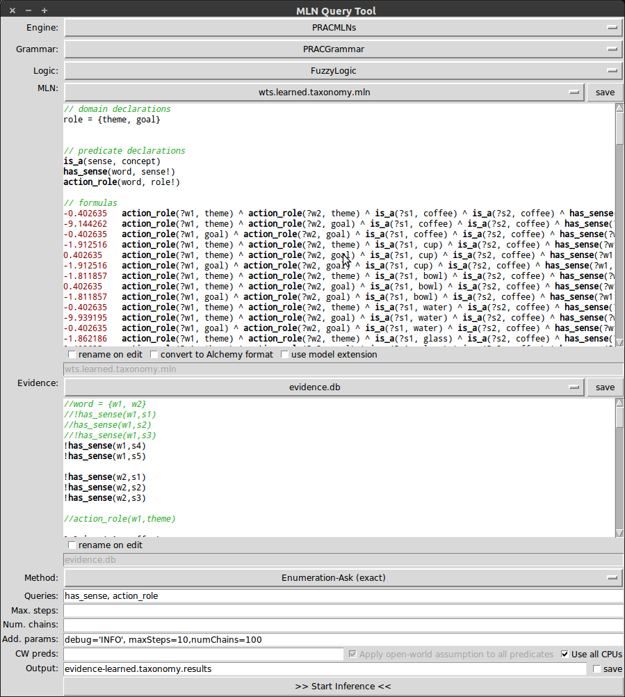

MLNQuery-Tool
=============

Start the tool from the command line with ``mlnquery``.

   The MLNQuery-Tool GUI.

The MLN query tool is an interface to make inferences in a Markov 
logic network. The tool allows you to invoke the actual MLN 
inference algorithms of either the Python-based MLN engine or the 
Alchemy system. Once you start the actual algorithm, the tool 
window itself will be hidden as long as the job is running, while 
the output of the algorithm is written to the console for you to 
follow. At the beginning, the tools list the main input parameters 
for your convenience, and, at the end, the query tool additionally 
outputs the inference results to the console (so even if you are 
using the Alchemy system, there is not really a need to open the 
results file that is generated).

The tool features integrated editors for ``.db`` and ``.mln`` files. If you 
modify a file in the internal editor, it will automatically be 
saved as soon as you invoke the learning or inference method. The 
new content can either be saved to the same file (overwriting the 
old content) or a new file, which you can choose to name as 
desired. Furthermore, the tool will save all the settings you made 
whenever the inference method is invoked, so that you can easily 
resume a session. When performing inference, one typically 
associates a particular query with each evidence database, so the 
query tool specifically remembers the query you made for each 
evidence database and restores it whenever you change back to the 
evidence database.

Given these inputs one can choose an [[Inference Methods|inference 
method]] and infer the values of the variables stated a 
comma-separated list of queries, where a query can be any one of 
the following:

* a ground atom, e.g. ``foobar(X,Y)``
* the name of a predicate, e.g. ``foobar``
* a ground formula, e.g. ``foobar(X,Y) ^ foobar(Y,X)`` (internal engine only) 

The additional parameters include:

* the maximal steps of the chosen inference method
* the number of parallel chains to use
* the possibility to define closed world (CW) predicates.
* additional command line parameters to pass on to Alchemy's infer when using the Alchemy system.
* the option to show additional debug outputs during the execution when using the internal system 
  (additional parameter: -debug = True). For example, with exact inference, setting ``debug`` to ``True``
  (i.e. writing ``debug=True`` into the input field) will print the entire distribution over 
  possible worlds. For MC-SAT, you could specify ``debug=True, debugLevel=30`` to get a detailed 
  log of what the algorithm does (changing debugLevel will affect the depth of the analysis).